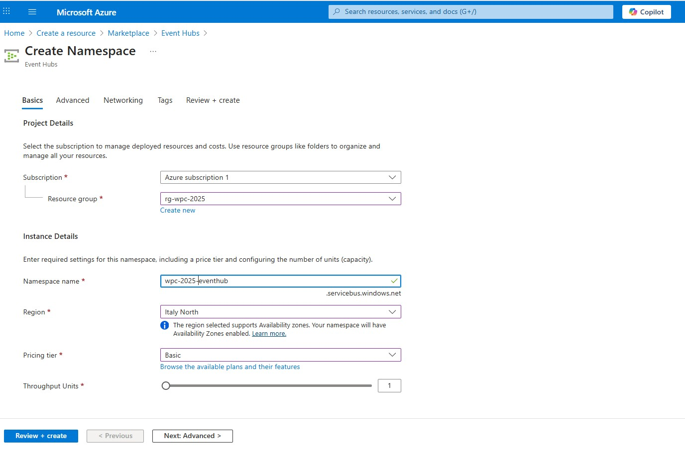
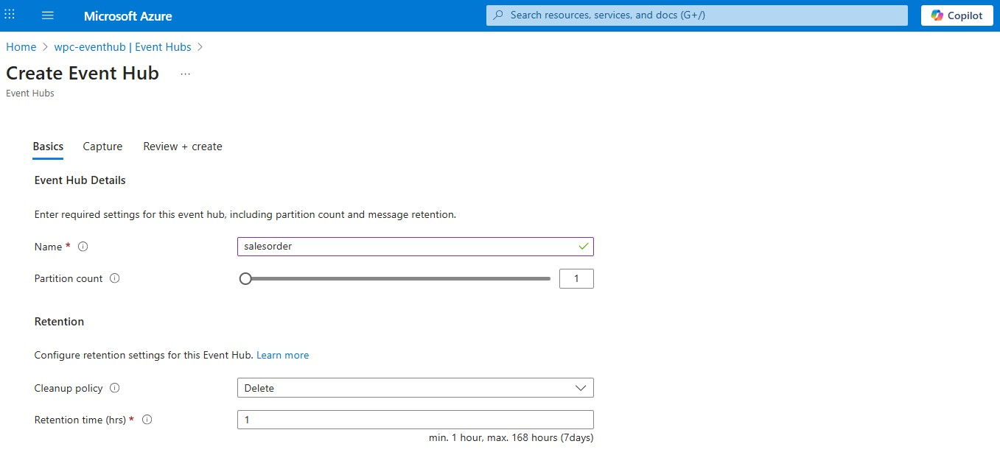
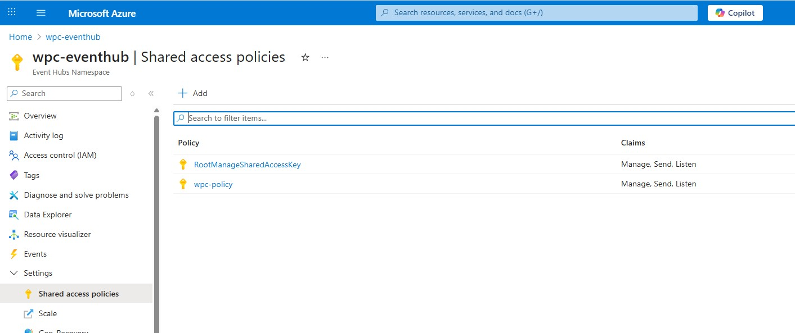

# Enable Change Event Streaming (CES) on SQL Server

Change Event Streaming (CES) is one of the most exciting new features coming in SQL Server 2025. It allows you to continuously stream row-level changes from your tables directly into Azure Event Hubs, where multiple consumer applications can subscribe to the event data in real time.

## Prerequisites

Before starting with Change Event Streaming setup, ensure you have:

### Azure Requirements

- **Azure Subscription**: Active subscription with appropriate permissions
- **Azure Event Hubs**: Namespace and Event Hub creation rights
- **PowerShell Modules**: Az and Az.EventHub modules (installation covered below)

### SQL Server Requirements

- [SQL Server limitations](https://learn.microsoft.com/en-us/sql/relational-databases/track-changes/change-event-streaming/configure?view=sql-server-ver17#limitations)

## Create an Event Hub

Change Event Streaming is designed to stream directly into Azure Event Hubs.  
Navigate in Azure Portal and create a new EventHub as you can see in the following image  
  

Create a new Entity

  

Create a new Policy

  

## Generate SAS Token

You'll need a Shared Access Signature (SAS) token for SQL Server and other clients to authenticate against the Event Hub. Because the Azure portal does not provide a GUI for generating SAS tokens, you must generate one using PowerShell, Azure CLI or the Azure SDK. In this case we'll use PowerShell

### Install PowerShell Modules

Run PowerShell as an administrator and install the necessary modules.  
Install the general Azure cmdlets (this can take up to 20 minutes)

```powershell
Install-Module -Name Az -Scope CurrentUser -Repository PSGallery -Force
Install-Module -Name Az.EventHub -Scope CurrentUser -Force
```

### Create a SAS Token Script

```powershell
function Generate-SasToken {
    # Provide values for following resources.
    $subscriptionId = "<Your SubscriptionId>"
    $resourceGroupName = "rg-wpc-2025"
    $namespaceName = "wpc-eventhub"
    $eventHubName = "eventstorehub"
    $policyName = "wpc-policy"

    # Login to Azure and set Azure Subscription.
    Connect-AzAccount

    # Get current context and check subscription
    $currentContext = Get-AzContext
    if ($currentContext.Subscription.Id -ne $subscriptionId) {
        Write-Host "Current subscription is $($currentContext.Subscription.Id), switching to $subscriptionId..."
        Set-AzContext -SubscriptionId $subscriptionId | Out-Null
    } else {
        Write-Host "Already using subscription $subscriptionId."
    }

    # Try to get the authorization policy (it should have Send rights)
    $rights = @("Send")
    $policy = Get-AzEventHubAuthorizationRule -ResourceGroupName $resourceGroupName -NamespaceName $namespaceName -EventHubName $eventHubName -AuthorizationRuleName $policyName -ErrorAction SilentlyContinue

    # If the policy does not exist, create it
    if (-not $policy) {
        Write-Output "Policy '$policyName' does not exist. Creating it now..."

        # Create a new policy with the Manage, Send and Listen rights
        $policy = New-AzEventHubAuthorizationRule -ResourceGroupName $resourceGroupName -NamespaceName $namespaceName -EventHubName $eventHubName -AuthorizationRuleName $policyName -Rights $rights
        if (-not $policy) {
            throw "Error. Policy was not created."
        }
        Write-Output "Policy '$policyName' created successfully."
    } else {
        Write-Output "Policy '$policyName' already exists."
    }

    if ("Send" -in $policy.Rights) {
        Write-Host "Authorization rule has required right: Send."
    } else {
        throw "Authorization rule is missing Send right."
    }

    $keys = Get-AzEventHubKey -ResourceGroupName $resourceGroupName -NamespaceName $namespaceName -EventHubName $eventHubName -AuthorizationRuleName $policyName

    if (-not $keys) {
        throw "Could not obtain Azure Event Hub Key. Script failed and will end now."
    }
    if (-not $keys.PrimaryKey) {
        throw "Could not obtain Primary Key. Script failed and will end now."
    }

    # Get the Primary Key of the Shared Access Policy
    $primaryKey = ($keys.PrimaryKey) 
    Write-Host $primaryKey

    ## Check that the primary key is not empty.

    # Define a function to create a SAS token (similar to the C# code provided)
    function Create-SasToken {
        param (
            [string]$resourceUri, [string]$keyName, [string]$key
        )

    $sinceEpoch = [datetime]::UtcNow - [datetime]"1970-01-01"
        $expiry = [int]$sinceEpoch.TotalSeconds + (60 * 60 * 24 * 31 * 6)  # 6 months
        $stringToSign = [System.Web.HttpUtility]::UrlEncode($resourceUri) + "`n" + $expiry
        $hmac = New-Object System.Security.Cryptography.HMACSHA256
        $hmac.Key = [Text.Encoding]::UTF8.GetBytes($key)
        $signature = [Convert]::ToBase64String($hmac.ComputeHash([Text.Encoding]::UTF8.GetBytes($stringToSign)))
        $sasToken = "SharedAccessSignature sr=$([System.Web.HttpUtility]::UrlEncode($resourceUri))&sig=$([System.Web.HttpUtility]::UrlEncode($signature))&se=$expiry&skn=$keyName"
        return $sasToken
    }

    # Construct the resource URI for the SAS token
    $resourceUri = "https://$namespaceName.servicebus.windows.net/$eventHubName"

    # Generate the SAS token using the primary key from the new policy
    $sasToken = Create-SasToken -resourceUri $resourceUri -keyName $policyName -key $primaryKey
    
    # Output the SAS token
    Write-Host "`n-- Generated SAS Token --" -ForegroundColor Gray
    Write-Host $sasToken -ForegroundColor White
    Write-Host "-- End of generated SAS Token --`n" -ForegroundColor Gray
 
    # Copy the SAS token to the clipboard
    $sasToken | Set-Clipboard
    Write-Host "The generated SAS token has been copied to the clipboard." -ForegroundColor Green
}

Generate-SasToken
```

### Run the script

Before you can execute the script, you must allow PowerShell to run local scripts:

```powershell
Set-ExecutionPolicy -Scope Process -ExecutionPolicy Bypass
```

Finally, run the script

```powershell
.\Generate-SAS-Token.ps1
```

## It's SQL time

Create Your Database, or, if you already have one, access to it!

### Configure Change Event Streaming

```sql
CREATE MASTER KEY ENCRYPTION BY PASSWORD = 'H@rd2Wpc$$P@$$w0rd'
```

> **⚠️ Security Note**: Replace the example password with a strong, unique password for your environment. Store this password securely as it's required for database operations.

Create a Database Scoped Credential

```sql
CREATE DATABASE SCOPED CREDENTIAL SqlCesCredential
WITH
  IDENTITY = 'SHARED ACCESS SIGNATURE',
  SECRET = '<your SAS Token>'
```

> **🔐 Security Reminder**:  

> - Replace `<your SAS Token>` with the actual SAS token generated from the PowerShell script
> - SAS tokens have a 6-month expiration - set up monitoring to renew before expiry
> - Store credentials securely and rotate them regularly
> - Use the principle of least privilege for Event Hub permissions

#### Enable Change Event Streaming for your database ... using a stored procedure

```sql
EXEC sys.sp_enable_event_stream
```

### Verify that it's enabled

```sql
SELECT * FROM sys.databases WHERE is_event_stream_enabled = 1
```

#### Now, you need to define an Event Stream Group. An Event Stream Group defines the Event Hub target for your events

```sql
EXEC sys.sp_create_event_stream_group
  @stream_group_name      = 'rg-wpc-2025',
  @destination_location   = 'wpc-eventhub.servicebus.windows.net/eventstorehub',
  @destination_credential = SqlCesCredential,
  @destination_type       = 'AzureEventHubsAmqp'
```

#### At this point you're ready to add tables to the Event Stream Group  

Decide whether to include old values and whether to include all columns. Each table in our demo uses different settings for different reasons; old values and all values are included when we need that extra context, and they are excluded in favor of reduced bandwidth for smaller event payloads when we don’t.

```sql
EXEC sys.sp_add_object_to_event_stream_group
  @stream_group_name      = 'rg-wpc-2025',
  @object_name = 'dbo.EventStore',
  @include_old_values = 0,      -- do not include old values on updates/deletes
  @include_all_columns = 1      -- include all columns even if unchanged
```

#### Verify  

```sql
EXEC sp_help_change_feed_table @source_schema = 'dbo', @source_name = 'EventStore'
```

#### The CloudEvent Payload  

```json
{
    "specversion": "1.0",
    "type": "com.microsoft.SQL.CES.DML.V1",
    "source": "\/",
    "id": "cc3fcdca-09c0-4f46-a8d3-5d0c3c1eb85a",
    "logicalid": "8376457a-17af-49f4-b9ea-0d5071f515f4:0000002C000007300011:00000000000000000002",
    "time": "2025-11-03T12:29:46.290Z",
    "datacontenttype": "application\/avro-json",
    "operation": "INS",
    "segmentindex": 1,
    "finalsegment": true,
    "data": "{\n  \"eventsource\": {\n    \"db\": \"WpcDemo\",\n    \"schema\": \"dbo\",\n    \"tbl\": \"Product\",\n    \"cols\": [\n      {\n        \"name\": \"ProductId\",\n        \"type\": \"int\",\n        \"index\": 0\n      },\n      {\n        \"name\": \"ItemsInStock\",\n        \"type\": \"smallint\",\n        \"index\": 5\n      }\n    ],\n    \"pkkey\": [\n      {\n        \"columnname\": \"ProductId\",\n        \"value\": \"2\"\n      }\n    ],\n    \"transaction\": {\n      \"commitlsn\": \"0000002C:00000730:0011\",\n      \"beginlsn\": \"0000002C:00000730:000C\",\n      \"sequencenumber\": 2,\n      \"committime\": \"2025-06-30T12:29:46.290Z\"\n    }\n  },\n  \"eventrow\": {\n    \"old\": \"{\\\"ProductId\\\": \\\"2\\\", \\\"ItemsInStock\\\": \\\"8\\\"}\",\n    \"current\": \"{\\\"ProductId\\\": \\\"2\\\", \\\"ItemsInStock\\\": \\\"7\\\"}\"\n  }\n}"
}
```

## Troubleshooting

### Common Issues and Solutions

#### 1. PowerShell Module Installation Issues

**Problem**: `Install-Module` fails or takes too long
```
Install-Module : Access is denied
```
**Solutions**:
- Run PowerShell as Administrator
- Use `-Scope CurrentUser` if you can't install system-wide
- Check execution policy: `Set-ExecutionPolicy -Scope Process -ExecutionPolicy Bypass`

#### 2. Azure Authentication Problems  
**Problem**: `Connect-AzAccount` fails or wrong subscription
```
Connect-AzAccount : AADSTS50058: A silent sign-in request was sent but no user is signed in.
```
**Solutions**:
- Ensure you're logged into the correct Azure tenant
- Use `Connect-AzAccount -TenantId <tenant-id>` for specific tenant
- Verify subscription access: `Get-AzSubscription`

#### 3. Event Hub Connection Issues
**Problem**: SQL Server can't connect to Event Hub
```
Error: Failed to connect to Event Hub endpoint
```
**Solutions**:
- Verify SAS token is not expired (6-month limit)
- Check firewall rules allow outbound connections to `*.servicebus.windows.net`
- Ensure Event Hub namespace and hub names are correct
- Verify the authorization policy has "Send" permissions

#### 4. Change Event Streaming Not Enabled
**Problem**: `sp_enable_event_stream` fails
```
Msg 40001, Database 'YourDB' is not enabled for change feed
```

**Solutions**:

- Verify SQL Server 2025 version supports CES
- Check database compatibility level
- Ensure you have `db_owner` permissions
- Verify master key exists: `SELECT * FROM sys.symmetric_keys WHERE name = '##MS_DatabaseMasterKey##'`

#### 5. Event Stream Group Creation Fails

**Problem**: Cannot create event stream group
```

The operation failed because the database scoped credential does not exist
```

**Solutions**:

- Ensure `SqlCesCredential` was created successfully
- Verify SAS token format (should start with `SharedAccessSignature sr=`)
- Check credential exists: `SELECT * FROM sys.database_scoped_credentials`

#### 6. No Events Being Streamed
**Problem**: Tables added but no events appear in Event Hub
**Solutions**:

- Verify table is added to stream group: `EXEC sp_help_change_feed_table`
- Check stream group status: `SELECT * FROM sys.event_stream_groups`
- Perform DML operations on tracked tables to generate events
- Monitor for errors in SQL Server error log

### Verification Commands

```sql
-- Check if Change Event Streaming is enabled
SELECT name, is_change_feed_enabled FROM sys.databases WHERE name = DB_NAME()

-- List all event stream groups
SELECT * FROM sys.event_stream_groups

-- Check tables in stream groups  
SELECT * FROM sys.event_stream_group_tables

-- Verify database scoped credentials
SELECT * FROM sys.database_scoped_credentials

-- Check stream status
EXEC sp_help_change_feed_table @source_schema = 'dbo', @source_name = 'EventStore'
```

### Getting Help

- **SQL Server Documentation**: [Change Event Streaming Documentation](https://learn.microsoft.com/en-us/sql/relational-databases/track-changes/change-event-streaming/overview?view=sql-server-ver17)
- **Azure Event Hubs**: [Event Hubs Troubleshooting Guide](https://learn.microsoft.com/en-us/azure/event-hubs/)
